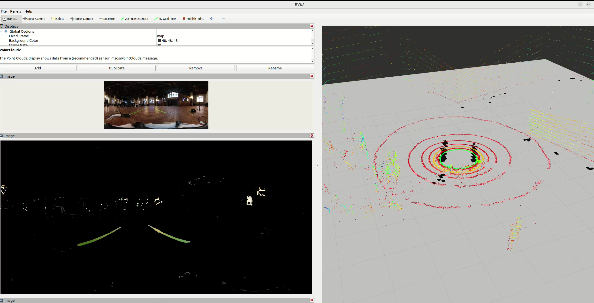

# Omnivision 🌐📸

A ros 2 package designed for 360° camera and lidar fusion. it captures equirectangular video feeds and lidar point clouds, fusing them to create textured 3d representations of the environment. omnivision provides visualization feeds and 360° depth information with only 2 sensors.

Applications include anywhere you need full surrounding depth information using only 2 sensors. This idea was originally created for full coverage lane detection, but would love to see other use cases!

This project was created for WayneHacks 3 @ Wayne State University! See the DevPost submission [here](https://devpost.com/software/immersive-visual-fusion?_gl=1*j515sv*_gcl_au*MTE2NzU3NDQ5OC4xNzM3MjcwNzg2*_ga*MTU5ODMzMzgwOS4xNzM3MjcwODM1*_ga_0YHJK3Y10M*MTc0MDExNjY0OC4xNC4xLjE3NDAxMTY2ODMuMC4wLjA.).

## Examples
### Image Overlay


### Texturized Pointcloud 


### Using depth information for plotting lanes


## Features 🚀

- **360° Camera and LiDAR Integration**: Full environmental coverage from 3D LiDAR and 360° camera.

- **Data Fusion**: Combine camera and LiDAR data to generate textured point clouds.

- **Depth Map Generation**: Creates textured and grayscale depth maps.

- **Dynamic Visualization Compute**: Only generates pointclouds / depthmaps when topics have subscribers.

## Installation 🛠️
### Prerequisites:w


- ROS 2 (Humble or newer recommended)

- Python 3.8+

- OpenCV

- PCL

- NumPy

### Steps

- Clone the repository into your ROS 2 workspace:
```sh
git clone git@github.com:BlaineKTMO/omnivision.git /path/to/ros2_ws/src/omnivision
```
Install dependencies:
```sh

sudo apt install ros-<your_ros2_distro>-cv-bridge ros-<your_ros2_distro>-pcl-ros
pip install numpy opencv-python
```
Build the package:
```sh
cd /path/to/ros2_ws
colcon build --symlink-install
```
Source the workspace:
```sh
source /path/to/ros2_ws/install/setup.bash
```
## Usage 🖥️
### Launching the Package

To start the Omnivision system, use the provided launch file:
```sh
ros2 launch omnivision bringup.launch.py
```

### Parameters

Customize the launch file with the following parameters:

- **camera_topic**: Topic name for the 360-degree camera feed (default: /camera/image_raw).

- **lidar_topic**: Topic name for the LiDAR point cloud data (default: /lidar/points).

- **output_topic**: Topic name for the fused textured point cloud (default: /omnivision/fused_cloud).

- **depth_map_topic**: Topic name for the generated depth map (default: /omnivision/depth_map).

### Example

To launch with custom topics:
```sh
ros2 launch omnivision bringup.launch.py camera_topic:=/my_camera lidar_topic:=/my_lidar
```

## To Do (Contributions Welcome!) 🛠️

- Optimization: Improve processing efficiency and reduce resource usage.

- LiDAR Interpolation: Add an option to interpolate LiDAR data for denser point clouds.

- Launch File Configuration: Expand the launch file to support more customization options.

- Documentation: Add additional details for usage or debugging.

- Testing: Add unit tests.

- Automatic localization: Capture camera transformation automatically.

## Contributing 🤝

This is a great project for new ROS2 developers to contribute to. Please create an issue prior to pull requesting to foster collaboration.

## License 📜

This project is licensed under the GNU GPL-3.0 License. See the LICENSE file for details.

## Contact 📧

For questions, suggestions, or collaboration opportunities, please open an issue on the repository or contact the maintainers directly.